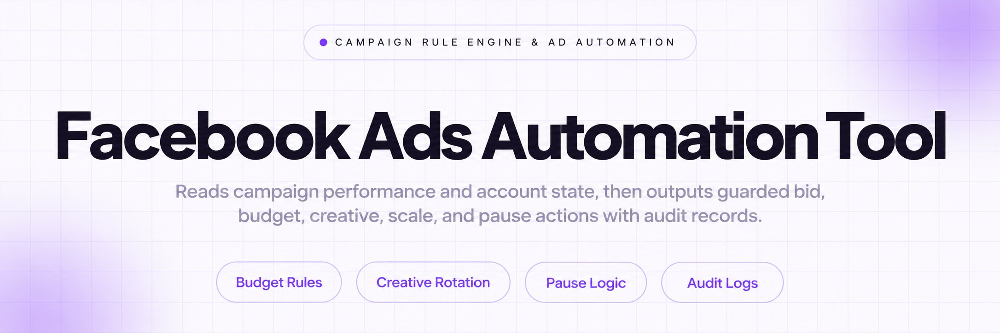
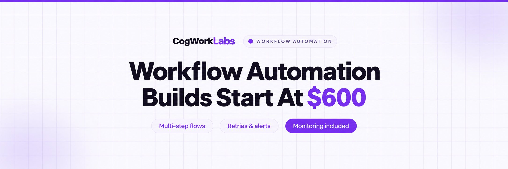
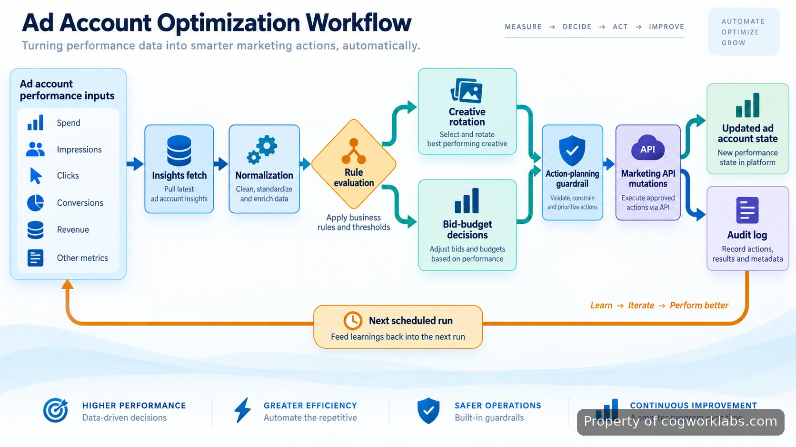

<p align="center">
  <a href="https://www.cogworklabs.com" target="_blank" rel="nofollow">
    
  </a>
</p>

## facebook ads automation tool

The **facebook ads automation tool** in this repository turns ad-account performance data into controlled bid, budget, creative, scale, and pause actions. I run it as an operator-side workflow: it reads campaign state, evaluates explicit rules, prepares allowed mutations, sends those changes through the <a href="https://developers.facebook.com/docs/marketing-apis/" target="_blank" rel="nofollow">Meta Marketing API</a>, and records what happened for the next run. The main fit is an account where routine decisions are already expressed as rules and the expensive part is checking them consistently.

This is not a dashboard that only reports metrics. The useful boundary is action: a rule can change a budget, pause an item, or place a different creative into rotation. Configuration keeps those decisions separate from API transport, so rule intent can be reviewed without reading request code. For external context, <a href="https://www.wordstream.com/blog/facebook-ads-benchmarks-2025" target="_blank" rel="nofollow">WordStream's 2025 Facebook Ads Benchmarks</a> covers more than 1,000 campaigns, while <a href="https://www.triplewhale.com/blog/facebook-ads-benchmarks" target="_blank" rel="nofollow">Triple Whale's 2026 Meta benchmarks</a> draws on more than 40,000 brands. Those reports are context, not thresholds for this repository.

<a href="https://www.cogworklabs.com" target="_blank" rel="nofollow">
  
</a>

<p align="center">
  <a href="https://t.me/Bitbash333" target="_blank" rel="nofollow">
    
  </a>&nbsp;
  <a href="https://wa.me/923249868488?text=Hi%2C%20I%27m%20interested." target="_blank" rel="nofollow">
    
  </a>&nbsp;
  <a href="mailto:hello@cogworklabs.com" target="_blank" rel="nofollow">
    
  </a>&nbsp;
  <a href="https://www.cogworklabs.com" target="_blank" rel="nofollow">
    
  </a>
</p>

## Core Features

| Feature | Description |
| --- | --- |
| Rule-based bid and budget decisions | Repeated account checks drift when the same conditions are judged by hand. The evaluator reads normalized performance fields and matches them against configured bid or budget rules before a write is allowed. |
| Creative rotation automation | Testing becomes hard to track when rotation depends on memory. The module selects eligible creatives from the configured pool and sends only approved changes through the API layer. |
| Performance-triggered ad pausing | Weak ads can keep running between reviews. Pause rules combine configured performance conditions with state checks so an already-inactive ad is not targeted again. |
| Scaling guardrails | A valid scaling rule can still be unsafe when applied twice. The planner checks current state, prior actions, and configured limits before scheduling a mutation. |
| Campaign performance monitoring | Rules need comparable input rather than endpoint-specific responses. The ingestion layer normalizes requested insight fields and attaches the campaign, ad-set, ad, and creative identifiers used by evaluation. |
| Audit-first mutations | Automation is hard to verify when the reason for a change disappears. Each proposed and applied action records its rule, target object, prior state, requested mutation, and API result. |

## How the Facebook ads rule engine makes a decision

The **Facebook ads rule engine** is split into fetch, normalize, evaluate, plan, and apply stages. The fetcher requests only fields referenced by configured rules. Normalization maps responses into one internal record shape. Evaluation is read-only: it returns a proposed action and matching rule. Planning rejects proposals that conflict with current state, prior actions, or another action in the same run. Only the apply stage can make a remote change.

A practical example is a pause rule whose configured performance condition and minimum-evidence condition both match. The evaluator reads those values from `config/rules.yaml` and emits `pause` for the ad ID. The planner then checks whether the ad is already paused and whether the same rule has an active action record. If either check blocks the proposal, the mutation is skipped and the reason is logged. That removes the failure mode where a scheduler keeps sending the same write because every run starts without memory.

## Meta Marketing API integration and mutation flow

The **Meta Marketing API integration** sits behind a provider interface. Authentication, field selection, pagination, retryable errors, object reads, and writes stay in the provider package; the rule engine receives domain records instead of response dictionaries. Creative changes follow the platform's <a href="https://developers.facebook.com/docs/marketing-api/reference/ad-creative/" target="_blank" rel="nofollow">Ad Creative reference</a>, performance collection uses the <a href="https://developers.facebook.com/docs/marketing-api/insights/" target="_blank" rel="nofollow">Insights API</a>, and failures are classified with <a href="https://developers.facebook.com/docs/graph-api/guides/error-handling/" target="_blank" rel="nofollow">Graph API error guidance</a>.

The separation matters during failure. A rate-limit response, permission error, or invalid object state must not look like a successful rule decision. The provider returns a typed result, and the runner records a successful action only after the remote mutation succeeds. A failed write remains visible as a failed attempt, so the next run fetches fresh state and evaluates again instead of assuming the previous change landed.

The audit record is also the handoff between automation and manual review. It preserves the proposed action even when a guard rejects it, which makes a dry run useful for checking rule coverage before enabling writes. When a live mutation fails, the stored failure stays attached to the same target and rule instead of being collapsed into a generic runner error.



## Creative rotation automation without mixing policy and transport

The **creative rotation automation** module treats testing policy as configuration. A rotation group lists eligible creative identifiers and the rule conditions that permit a change. The evaluator can choose a replacement, but it cannot call the API directly; it emits a planned action naming the current creative, candidate, target ad, and matching rule.

That distinction is useful when testing policy changes. I can edit the rotation rules and run the same fixture through `--dry-run` to inspect proposed swaps without touching a live ad. The same planner applies state checks and deduplication to creative and budget changes, removing the failure mode where one API code path respects a guardrail while another bypasses it.

<a href="https://tally.so/r/b5QYLL?platform=GitHub&amp;format=Product+repo&amp;brand=CogWorkLabs&amp;niche=automation&amp;page=Facebook+Ads+Automation+Tool+using+Meta+Marketing+API&amp;date=2026-09-22" target="_blank" rel="nofollow">
  
</a>

## Tech stack and runtime boundaries

The runtime is a small <a href="https://docs.python.org/3/" target="_blank" rel="nofollow">Python</a> service with configuration files, a database-backed action history, and a scheduler entry point. Python keeps evaluator and provider code easy to test from fixtures. <a href="https://www.postgresql.org/docs/current/tutorial-transactions.html" target="_blank" rel="nofollow">PostgreSQL</a> stores run and action records so remote mutations and local audit state can be reconciled predictably.

| Layer | Responsibility |
| --- | --- |
| Runner | Loads configuration, fetches account state, and coordinates evaluation and application. |
| Provider | Owns token use, API reads and writes, pagination, mapping, and error classification. |
| Rules | Contains bid, budget, scale, pause, and rotation conditions as data rather than request code. |
| Planner | Resolves conflicts, checks status and prior actions, and creates the ordered mutation plan. |
| Store | Persists runs, proposed actions, applied actions, failures, and deduplication identifiers. |

Scheduling is separate from rule logic. A host scheduler invokes the same run command used manually. The application only needs environment-provided credentials and configuration; timing does not change how an ad decision is evaluated.

## Directory structure

The layout keeps rule policy, API transport, persistence, and orchestration in separate packages. Changes to a budget condition normally land under `rules` or configuration, while endpoint handling belongs under `providers/meta`. Tests mirror those boundaries so fixtures can exercise rule behavior without a remote request.

```text
ads-automation/
├── app/
│   ├── run.py
│   ├── config.py
│   ├── models.py
│   ├── providers/
│   │   └── meta/
│   │       ├── client.py
│   │       ├── insights.py
│   │       ├── mutations.py
│   │       └── errors.py
│   ├── rules/
│   │   ├── evaluator.py
│   │   ├── budget.py
│   │   ├── bids.py
│   │   ├── pause.py
│   │   └── rotation.py
│   ├── planner/
│   │   ├── actions.py
│   │   └── guards.py
│   └── store/
│       ├── repository.py
│       └── schema.sql
├── config/
│   ├── rules.example.yaml
│   └── creative-groups.example.yaml
├── tests/
│   ├── fixtures/
│   │   ├── insights.json
│   │   └── objects.json
│   ├── test_rules.py
│   └── test_planner.py
├── scripts/
│   ├── run_once.sh
│   └── benchmark.sh
├── docker-compose.yml
├── requirements.txt
└── README.md
```

## Performance benchmarks for campaign performance monitoring

Performance is measured against fixture size and execution mode rather than a headline runtime. A dry run exercises parsing, normalization, rule evaluation, conflict resolution, and audit serialization without remote writes. A live run adds network latency and platform throttling, so combining them produces a benchmark that is hard to reproduce. The repository keeps a fixture-driven benchmark command beside the tests and treats API timing separately.

```bash
./scripts/benchmark.sh tests/fixtures/insights.json
python -m app.run --config config/rules.example.yaml --dry-run
python -m app.run --config config/rules.example.yaml --apply
```

I do not publish a throughput or run-time figure because the supplied brief does not provide one. The benchmark output is the source of truth for a given checkout and fixture. What is measurable without guessing is the control path: one normalized snapshot is evaluated, proposed actions are deduplicated, and only approved mutations reach the provider.

## Use Cases

- Keep **ad budget automation** consistent across recurring reviews by encoding the conditions once, then letting the planner reject duplicate or conflicting budget changes before they reach the API.
- Run controlled creative tests without hand-tracking which asset should rotate next; the configured pool, eligibility conditions, current assignment, and prior action history all feed the same mutation plan.
- Apply **performance-triggered ad pausing** after configured evidence and efficiency conditions are met, while preserving a reasoned audit record instead of relying on an operator to remember why an ad stopped.
- Use the repository as **Facebook ads workflow automation** for repeated account checks: fetch current metrics, evaluate bid or budget rules, prepare eligible actions, apply them, and carry the recorded state into the next run.

## How to Automate Campaign Decisions Using facebook ads automation tool

- **STEP 1 — Download & Set Up the Project** Download, set up, and install **facebook ads automation tool** to get the project running. Clone or download this repository, then copy the example configuration.
- **STEP 2 — Load Account Inputs** Start with the CLI, point it at the rule file, and provide the ad-account identifier plus credentials through environment variables.
- **STEP 3 — Review the Plan** Run `--dry-run` to fetch current metrics, evaluate rules, and print proposed budget, bid, pause, scale, or creative actions without writing them.
- **STEP 4 — Apply and Inspect** Run with `--apply`; successful mutations go to the ad account and the local store records each action, failure, and rule reason.

## FAQ

### What permissions and tokens does the tool need?

It needs credentials that can read the account objects and insights referenced by configured rules, plus write access for the mutations you enable. Keep them in environment variables or a secret store, scoped to the account and actions the runner uses.

### How does it avoid repeated budget or pause actions?

The planner checks current object state and prior action records before applying a proposal. If the desired state already exists or a deduplication guard is active, the action is skipped and logged instead of sent twice.

### Can the creative rotation logic change without editing API code?

Yes. Rotation policy lives in configuration and rule modules, while the provider owns remote request details. A condition or creative pool can change without rewriting authentication, pagination, error handling, or mutation transport.

<table>
  <tr>
    <td align="center" width="33%">
      
      <p>This scraper helped me gather thousands of posts effortlessly. The setup was fast, and exports are super clean and well-structured.</p>
      <p><b>Nathan Pennington</b><br>Marketer<br>★★★★★</p>
    </td>
    <td align="center" width="33%">
      
      <p>What impressed me most was how accurate the extracted data is. Likes, comments, timestamps — everything aligns perfectly.</p>
      <p><b>Greg Jeffries</b><br>SEO Affiliate Expert<br>★★★★★</p>
    </td>
    <td align="center" width="33%">
      
      <p>It's by far the best tool I've used. Ideal for trend tracking, competitor monitoring, and influencer insights.</p>
      <p><b>Karan</b><br>Digital Strategist<br>★★★★★</p>
    </td>
  </tr>
</table>